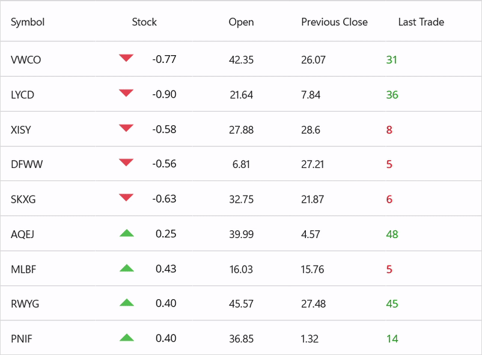

# Mastering-realtime-data-updates-in-.NET-MAUI-DataGrid
This demo shows Mastering realtime data updates in .NET MAUI DataGrid.

---

## Introduction
In today’s fast-paced digital world, real-time data is no longer a luxury—it’s a necessity. Whether you’re building a financial dashboard, an IoT monitoring app, or an e-commerce analytics tool, users expect instant updates without refreshing the screen.

**.NET MAUI DataGrid** offers a powerful way to display and update data dynamically across platforms.

## Why Live Data Updates Matter
- Keep information fresh for better user trust and engagement
- Support faster decisions with up-to-the-second data
- Eliminate manual refresh actions and reduce cognitive load

---

## Why Choose Syncfusion .NET MAUI DataGrid?
- **Smooth, cell-level updates:** Responds instantly to `INotifyPropertyChanged`
- **Rich UX:** Sorting, selection, responsive columns, and templating
- **Performance-focused:** Virtualization and lightweight rendering
- **Flexible styling:** Template columns, triggers, and styles
- **Enterprise-ready:** Backed by dedicated support and production-grade reliability

---

## Run the App
When you run the app on **Android, iOS, Windows, or macOS**, your DataGrid will breathe with data updates every second.

No manual refreshes, no flickering—just smooth, seamless live updates powered by data binding and property change notifications.

---
## Conclusion
Thanks for reading! In this blog, we’ve seen Mastering realtime data updates in `.NET MAUI DataGrid`[https://www.syncfusion.com/maui-controls/maui-datagrid]. Check out our `Release Notes`[https://www.syncfusion.com/products/release-history] and `What’s New pages`[https://www.syncfusion.com/products/whatsnew] to see the other updates in this release and leave your feedback in the comments section below. 
For current Syncfusion customers, the newest version of Essential Studio is available from the `license and downloads page`[https://www.syncfusion.com/Account/Login?ReturnUrl=%2faccount%2fdownloads]. If you are not yet a customer, you can try our 30-day `free trial`[https://www.syncfusion.com/downloads] to check out these new features. 
For questions, you can contact us through our `support forums`[https://www.syncfusion.com/forums], `feedback portal`[https://www.syncfusion.com/feedback], or `support portal`[https://support.syncfusion.com/]. We are always happy to assist you!

